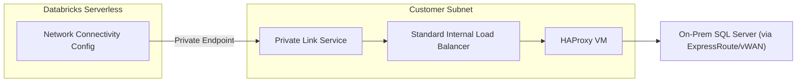

# Databricks Serverless SQL Proxy

Deploys an HAProxy Ubuntu/RHEL VM behind an internal Standard Load Balancer and an Azure Private Link Service, so that Azure Databricks **Serverless** compute (which only supports Private Link, not VNet injection) can reach an on-premises SQL Server over ExpressRoute/vWAN.



## Deploy

| Template | Purpose |
|---|---|
| [](https://portal.azure.com/#create/Microsoft.Template/uri/https%3A%2F%2Fraw.githubusercontent.com%2FL3vinax%2FServerlessdbproxy%2Fmain%2Fazuredeploy.json) | Initial deployment: NSG, load balancer, HAProxy VM, Private Link Service, and (optionally) Databricks NCC. Source: [main.bicep](main.bicep) |
| [](https://portal.azure.com/#create/Microsoft.Template/uri/https%3A%2F%2Fraw.githubusercontent.com%2FL3vinax%2FServerlessdbproxy%2Fmain%2Fupdate-haproxy-backends.json) | Adds/updates listener ports, backends, and HAProxy config on an already-deployed VM. Source: [update-haproxy-backends.bicep](update-haproxy-backends.bicep) |

You can also deploy from the CLI using the parameter file examples in [examples/](examples/):

```bash
az deployment group create \
  --resource-group <deployment-rg> \
  --template-file main.bicep \
  --parameters examples/main.bicepparam
```

## Prerequisites

- Existing subnet with routing to on-premises through vWAN/ExpressRoute.
- Private Link service network policies disabled on that subnet (see command below).
- Outbound package access for cloud-init to install HAProxy, either directly or through the customer's approved egress path.
- Return routing and firewall access from the on-premises SQL Server to the HAProxy subnet.

```bash
az network vnet subnet update \
  --resource-group <network-rg> \
  --vnet-name <vnet> \
  --name <subnet> \
  --disable-private-link-service-network-policies true
```

## Parameters (main.bicep)

| Parameter | Default | Description |
|---|---|---|
| `location` | resource group location | Azure region for all resources. |
| `prefix` | `dbx-sqlproxy` | Name prefix applied to all deployed resources. |
| `subnetResourceId` | *required* | Existing subnet resource ID (Private Link network policies must be disabled). |
| `adminUsername` | `azureadmin` | Admin username for the HAProxy VM. |
| `sshPublicKey` | *required* | SSH public key contents (not a path), `ssh-rsa` or `ssh-ed25519`. |
| `vmSize` | `Standard_D2s_v5` | HAProxy VM size. |
| `osType` | `Ubuntu` | `Ubuntu` or `RHEL`. |
| `frontendPort` | `1433` | Load balancer/HAProxy listener port. |
| `sqlServerAddress` | *required* | On-premises SQL Server IP or DNS name. |
| `sqlServerPort` | `1433` | On-premises SQL Server port. |
| `maxConnections` | `10000` | HAProxy `maxconn`. |
| `visibilitySubscriptionIds` | `[]` | Subscription IDs allowed to see the Private Link Service. |
| `autoApprovalSubscriptionIds` | `[]` | Subscription IDs whose private endpoint connections auto-approve. |
| `tags` | `{}` | Tags applied to all resources. |
| `deployDatabricksNcc` | `false` | Also configure a Databricks Network Connectivity Config and private endpoint (see below). |
| `databricksAccountConsoleUrl` | `https://accounts.azuredatabricks.net` | Databricks account console URL. |
| `databricksAccountId` | `''` | Databricks account ID. Required if `deployDatabricksNcc` is `true`. |
| `databricksWorkspaceId` | `''` | Numeric Databricks workspace ID (not the ARM resource ID). Required if `deployDatabricksNcc` is `true`. |
| `databricksRegion` | `''` | Azure region in Databricks region format (e.g. `westus2`). Required if `deployDatabricksNcc` is `true`. |
| `privateLinkServiceDomainNames` | `[]` | Domain name(s) clients use to reach the Private Link Service. |
| `databricksNccIdentityResourceId` | `''` | User-assigned managed identity resource ID that is an Account Admin in the Databricks account. Required if `deployDatabricksNcc` is `true`. |

**Outputs:** `privateLinkServiceId`, `privateLinkServiceAlias`, `haproxyVmName`, `frontendPort`, `networkConnectivityConfigId` (empty string when `deployDatabricksNcc` is `false`).

## Update HAProxy Backends

Use [update-haproxy-backends.bicep](update-haproxy-backends.bicep) to add or change listener ports, backends, and HAProxy config on an already-deployed load balancer/VM.

**The `backends` list is authoritative** — include every existing listener/backend that should remain after the update, or it will be removed.

| Parameter | Description |
|---|---|
| `vmName` | Name of the existing HAProxy VM. |
| `loadBalancerName` | Name of the existing internal load balancer. |
| `subnetResourceId` | Resource ID of the subnet currently used by the load balancer frontend. |
| `networkSecurityGroupName` | Name of the existing NSG attached to the HAProxy VM NIC. |
| `maxConnections` | HAProxy `maxconn` (default `10000`). |
| `backends` | Authoritative array of `{ name, frontendPort, servers: [{ name, address, port }] }`. Multiple `servers` entries are for redundant copies of the *same* SQL Server behind one port; distinct SQL Servers each need their own backend with a unique `name`/`frontendPort`. |

Example ([examples/update-haproxy-backends.bicepparam](examples/update-haproxy-backends.bicepparam)):

```bicep
param backends = [
  {
    name: 'sql-prod'
    frontendPort: 1433
    servers: [
      { name: 'sql01', address: '10.100.20.25', port: 1433 }
    ]
  }
  {
    name: 'sql-reporting'
    frontendPort: 1434
    servers: [
      { name: 'sql02', address: '10.100.20.40', port: 1433 }
    ]
  }
]
```

```bash
az deployment group create \
  --resource-group <deployment-rg> \
  --template-file update-haproxy-backends.bicep \
  --parameters examples/update-haproxy-backends.bicepparam
```

## Validate

```bash
az vm run-command invoke \
  --resource-group <deployment-rg> \
  --name dbx-sqlproxy-prod-vm \
  --command-id RunShellScript \
  --scripts 'haproxy -c -f /etc/haproxy/haproxy.cfg && systemctl is-active haproxy'
```

This baseline uses one VM. Use two zonal VMs for production availability.

## Configure Databricks NCC (Preview)

The steps below happen automatically when `deployDatabricksNcc` is `true` (see [modules/databricks-ncc.bicep](modules/databricks-ncc.bicep)); otherwise perform them manually:

1. Configure the Serverless Databricks workspace to use a Network Connectivity Config (NCC).
2. In the NCC, add a private endpoint rule to the Private Link Service created by this deployment.

Automating this requires an existing Databricks workspace, its account ID and numeric workspace ID, and a user-assigned managed identity that is an **Account Admin** on the Databricks account (this membership must be granted manually in the [Databricks Account Console](https://accounts.azuredatabricks.net) — there is no ARM API for it).

## Repository Layout

```
main.bicep                       # Entry point: NSG, load balancer, HAProxy VM, Private Link Service, optional NCC
update-haproxy-backends.bicep    # Standalone update to an existing deployment's listeners/backends
azuredeploy.json                 # Compiled ARM template for main.bicep (used by the Deploy to Azure button)
update-haproxy-backends.json     # Compiled ARM template for update-haproxy-backends.bicep
modules/
  nsg.bicep                      # Network security group and rules
  load-balancer.bicep            # Standard internal load balancer, backend pool, health probe
  haproxy-vm.bicep               # Ubuntu/RHEL VM with cloud-init HAProxy install/config
  private-link-service.bicep     # Private Link Service fronting the load balancer
  databricks-ncc.bicep           # Databricks Account API calls for NCC + private endpoint
examples/
  main.bicepparam                 # Sample parameters for main.bicep
  update-haproxy-backends.bicepparam
terraform/
  databricks-ncc-private-link.tf # Terraform equivalent of the NCC/private endpoint configuration
```

> This script is provided as-is. Please validate all deployments.